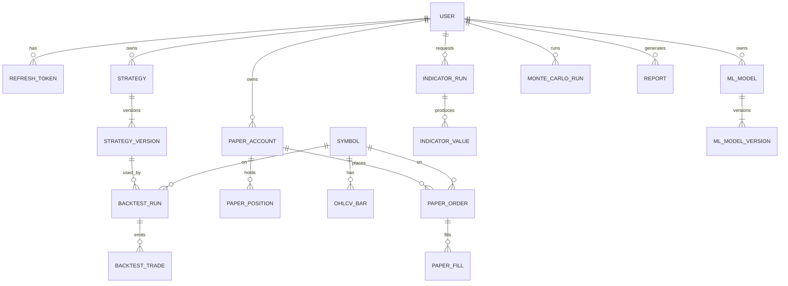

# TradeLab — Database Design

**Document type:** Phase 0 planning  
**RDBMS:** PostgreSQL  
**ORM (implementation phase):** SQLAlchemy  
**Migrations:** Alembic  
**Constraint:** This document describes the logical/physical design in prose. **No SQL DDL is included.**

---

## 1. Design Goals

1. Normalize transactional data (users, orders, jobs, strategies) to reduce anomalies.
2. Store time-series OHLCV and indicator points in efficient, queryable tables with strong uniqueness.
3. Keep large binary/array artifacts out of PostgreSQL — store in S3; keep metadata and keys in DB.
4. Enforce **ownership** (`user_id`) for multi-tenant safety in Phase A.
5. Prefer **soft deletes** for user-facing entities that may be referenced by historical jobs.
6. Support future microservice split by keeping domain tables loosely coupled (minimal cross-domain FKs where an ID reference + API suffices).

---

## 2. Entity Catalog

### 2.1 Identity & Auth

#### User
| Attribute | Notes |
|-----------|--------|
| id | UUID PK |
| email | Unique, required |
| password_hash | Required |
| display_name | Required |
| role | Enum: `user`, `admin` (default `user`) |
| is_active | Boolean |
| created_at, updated_at | Timestamps |

#### RefreshToken (optional but recommended)
| Attribute | Notes |
|-----------|--------|
| id | UUID PK |
| user_id | FK → User |
| token_hash | Unique; store hash not raw token |
| expires_at | Timestamp |
| revoked_at | Nullable |
| created_at | Timestamp |

---

### 2.2 Market Data

#### Symbol
| Attribute | Notes |
|-----------|--------|
| id | UUID PK |
| ticker | e.g., `RELIANCE` |
| yahoo_symbol | e.g., `RELIANCE.NS` (unique) |
| exchange | Default `NSE` |
| name | Optional company name |
| currency | Default `INR` |
| is_active | Boolean |
| created_at, updated_at | Timestamps |

#### OhlcvBar
| Attribute | Notes |
|-----------|--------|
| id | BigInt or UUID PK |
| symbol_id | FK → Symbol |
| interval | Enum/text: `1d`, `1h`, … |
| ts | Bar timestamp (UTC, timezone-aware) |
| open, high, low, close | Numeric |
| volume | Numeric/bigint |
| adjusted_close | Nullable numeric |
| source | e.g., `yfinance` |
| created_at | Timestamp |

**Uniqueness:** `(symbol_id, interval, ts)` unique.

#### MarketDataFetch
| Attribute | Notes |
|-----------|--------|
| id | UUID PK |
| user_id | FK → User (who requested) |
| symbol_id | FK → Symbol |
| interval | Text |
| start_ts, end_ts | Requested range |
| status | `queued` / `running` / `succeeded` / `failed` |
| bars_upserted | Integer |
| error_message | Nullable |
| started_at, finished_at | Nullable |
| created_at | Timestamp |

---

### 2.3 Indicators

#### IndicatorRun
| Attribute | Notes |
|-----------|--------|
| id | UUID PK |
| user_id | FK → User |
| symbol_id | FK → Symbol |
| interval | Text |
| start_ts, end_ts | Range |
| specs | JSON — list of indicator name + params |
| library | e.g., `pandas-ta` + version string |
| status | Job-like status |
| error_message | Nullable |
| created_at, finished_at | Timestamps |

#### IndicatorValue
| Attribute | Notes |
|-----------|--------|
| id | BigInt/UUID PK |
| run_id | FK → IndicatorRun |
| indicator_key | e.g., `RSI_14`, `MACD_line` |
| ts | Timestamp |
| value | Numeric (nullable if undefined) |

**Uniqueness:** `(run_id, indicator_key, ts)` unique.  
**Alternative (scalability):** store dense series as S3 JSON/Parquet and keep only IndicatorRun in DB — decide before Phase A if series are large.

---

### 2.4 Prediction (ML)

#### MLModel
| Attribute | Notes |
|-----------|--------|
| id | UUID PK |
| user_id | FK → User |
| name | Display name |
| symbol_id | FK → Symbol |
| problem_type | `classification` / `regression` |
| target_definition | JSON (e.g., next-day direction) |
| feature_config | JSON |
| created_at, updated_at | Timestamps |
| deleted_at | Soft delete |

#### MLModelVersion
| Attribute | Notes |
|-----------|--------|
| id | UUID PK |
| model_id | FK → MLModel |
| version | Integer monotonic per model |
| algorithm | `sklearn_*` / `xgboost` |
| hyperparameters | JSON |
| metrics | JSON |
| artifact_s3_key | Text |
| training_job_id | FK → Job (or embedded status fields) |
| status | `training` / `ready` / `failed` |
| created_at | Timestamp |

**Uniqueness:** `(model_id, version)` unique.

#### PredictionRequest (optional audit of inferences)
| Attribute | Notes |
|-----------|--------|
| id | UUID PK |
| model_version_id | FK |
| user_id | FK |
| input_context | JSON (as-of date, features snapshot ref) |
| output | JSON |
| created_at | Timestamp |

---

### 2.5 Monte Carlo

#### MonteCarloRun
| Attribute | Notes |
|-----------|--------|
| id | UUID PK |
| user_id | FK → User |
| symbol_id | Nullable FK (if single-asset) |
| config | JSON (paths, horizon, model, seed, …) |
| summary | JSON (percentiles, stats) |
| paths_s3_key | Nullable |
| status | Job status |
| error_message | Nullable |
| created_at, finished_at | Timestamps |

---

### 2.6 Strategy

#### Strategy
| Attribute | Notes |
|-----------|--------|
| id | UUID PK |
| user_id | FK → User |
| name | Text |
| description | Text |
| latest_version | Integer |
| deleted_at | Soft delete |
| created_at, updated_at | Timestamps |

#### StrategyVersion
| Attribute | Notes |
|-----------|--------|
| id | UUID PK |
| strategy_id | FK → Strategy |
| version | Integer |
| definition | JSON (rules, sizing, risk) — immutable once created |
| created_at | Timestamp |

**Uniqueness:** `(strategy_id, version)` unique.  
Backtests reference **StrategyVersion**, not mutable Strategy head.

---

### 2.7 Backtesting

#### BacktestRun
| Attribute | Notes |
|-----------|--------|
| id | UUID PK |
| user_id | FK → User |
| strategy_version_id | FK → StrategyVersion |
| symbol_id | FK → Symbol |
| interval | Text |
| start_ts, end_ts | Range |
| params | JSON (costs, slippage, fill model, initial cash) |
| metrics | JSON |
| status | Job status |
| error_message | Nullable |
| equity_s3_key / trades inline | Prefer trades table for query; large equity optional S3 |
| created_at, finished_at | Timestamps |

#### BacktestTrade
| Attribute | Notes |
|-----------|--------|
| id | UUID/BigInt PK |
| backtest_run_id | FK |
| ts | Timestamp |
| side | `buy` / `sell` |
| quantity | Numeric |
| price | Numeric |
| fees | Numeric |
| meta | JSON nullable |

#### BacktestEquityPoint (optional normalized)
| Attribute | Notes |
|-----------|--------|
| backtest_run_id | FK |
| ts | Timestamp |
| equity | Numeric |
| cash | Numeric |
| **PK/Unique** | `(backtest_run_id, ts)` |

---

### 2.8 Paper Trading

#### PaperAccount
| Attribute | Notes |
|-----------|--------|
| id | UUID PK |
| user_id | FK → User |
| name | Default `Primary` |
| currency | `INR` |
| cash_balance | Numeric |
| initial_cash | Numeric |
| status | `active` / `closed` |
| created_at, updated_at | Timestamps |

**Uniqueness (v1):** one active primary account per user unless multi-account is enabled — enforce with partial unique index if needed.

#### PaperOrder
| Attribute | Notes |
|-----------|--------|
| id | UUID PK |
| account_id | FK → PaperAccount |
| symbol_id | FK → Symbol |
| side | `buy` / `sell` |
| order_type | `market` / `limit` |
| quantity | Numeric |
| limit_price | Nullable |
| status | `pending` / `filled` / `cancelled` / `rejected` |
| created_at, updated_at | Timestamps |

#### PaperFill
| Attribute | Notes |
|-----------|--------|
| id | UUID PK |
| order_id | FK → PaperOrder |
| ts | Timestamp |
| quantity | Numeric |
| price | Numeric |
| fees | Numeric |

#### PaperPosition
| Attribute | Notes |
|-----------|--------|
| id | UUID PK |
| account_id | FK |
| symbol_id | FK |
| quantity | Numeric |
| avg_cost | Numeric |
| updated_at | Timestamp |

**Uniqueness:** `(account_id, symbol_id)` unique.

#### PaperTransaction (ledger, recommended)
| Attribute | Notes |
|-----------|--------|
| id | UUID PK |
| account_id | FK |
| type | `deposit` / `withdrawal` / `trade` / `fee` / `reset` |
| amount | Signed numeric (cash impact) |
| ref_type / ref_id | Polymorphic reference |
| created_at | Timestamp |

---

### 2.9 Reports & Jobs

#### Report
| Attribute | Notes |
|-----------|--------|
| id | UUID PK |
| user_id | FK → User |
| title | Text |
| sections | JSON — references to runs/models/accounts + inline summaries |
| artifact_s3_key | Nullable |
| status | `generating` / `ready` / `failed` |
| created_at, finished_at | Timestamps |

#### Job (generic optional umbrella)
If not embedded per domain, a central Job table can unify polling:

| Attribute | Notes |
|-----------|--------|
| id | UUID PK |
| user_id | FK |
| job_type | Enum |
| status | Enum |
| resource_type / resource_id | Points to domain row |
| progress | Optional 0–100 |
| error_message | Nullable |
| created_at, started_at, finished_at | Timestamps |

---

## 3. Relationships (ER Overview)

---

## 4. Important Indexes

| Table | Index | Purpose |
|-------|--------|---------|
| User | unique(email) | Login |
| Symbol | unique(yahoo_symbol) | Provider identity |
| OhlcvBar | unique(symbol_id, interval, ts) | Idempotent upserts |
| OhlcvBar | (symbol_id, interval, ts) range scans | History queries (covered by unique) |
| IndicatorValue | (run_id, indicator_key, ts) | Series retrieval |
| Strategy | (user_id, deleted_at) | List user strategies |
| StrategyVersion | unique(strategy_id, version) | Version lookup |
| BacktestRun | (user_id, created_at DESC) | History |
| BacktestTrade | (backtest_run_id, ts) | Trade timeline |
| PaperOrder | (account_id, status) | Open orders |
| PaperPosition | unique(account_id, symbol_id) | Position book |
| MLModelVersion | unique(model_id, version) | Model registry |
| MonteCarloRun | (user_id, created_at DESC) | History |
| Report | (user_id, created_at DESC) | History |
| Job | (status, created_at) | Worker polling |
| RefreshToken | (user_id), unique(token_hash) | Session management |

---

## 5. Normalization Decisions

| Decision | Rationale |
|----------|-----------|
| **3NF for users, accounts, orders, strategies** | Avoid update anomalies; clear ownership |
| **Strategy vs StrategyVersion** | Immutable snapshots for reproducible backtests |
| **MLModel vs MLModelVersion** | Registry pattern; artifacts versioned |
| **OHLCV as relational rows** | Simple queries/filters in v1; acceptable for daily NSE history |
| **Optional denormalization: metrics JSON on runs** | Avoid wide metric tables; metrics are write-once |
| **definition/config/specs as JSON** | Flexible DSL without schema migrations per indicator/param |
| **S3 for blobs** | Prevents DB bloat; keeps backups smaller |
| **Paper ledger (PaperTransaction)** | Auditability of cash beyond mutable `cash_balance` |
| **Soft deletes on Strategy / MLModel** | Preserve FK integrity for historical runs |
| **Avoid cross-module cascade deletes** | Prefer restrict + soft delete to protect audit trails |

### When to denormalize later

- Extremely large IndicatorValue tables → Parquet in S3 + run metadata only.
- Equity curves with millions of points → S3 only.
- Read-heavy dashboards → materialized summary tables (Phase A+).

---

## 6. Data Types Guidance

- **Money / prices:** `Numeric` with fixed scale (e.g., 12,4 or 18,6) — avoid float.
- **IDs:** UUID for public resources; BigInt acceptable for high-volume time series.
- **Timestamps:** Always timezone-aware UTC.
- **Enums:** PostgreSQL enums or check-constrained text — prefer text + app enum for easier Alembic evolution unless stability is certain.

---

## 7. Multi-Tenancy & Integrity Rules

1. Every user-owned row includes `user_id` (directly or via parent).
2. Services verify ownership before read/write.
3. Unique constraints prevent duplicate bars and duplicate positions.
4. Foreign keys from runs to StrategyVersion/Symbol remain even if parent Strategy is soft-deleted.

---

## 8. Migration Strategy (Alembic — Implementation Phase)

- One linear migration history.
- Initial migration creates core auth + symbols + ohlcv.
- Subsequent migrations add domain tables module-by-module aligned with the roadmap.
- Never edit applied migrations; add new ones.

---

## 9. Open Design Choices (Resolve Before / Early Phase A)

| Topic | Options |
|-------|---------|
| Indicator storage | Rows vs S3 series blobs |
| Central Job table vs per-domain status | Central simplifies polling API |
| Multi paper accounts | Single vs many |
| Short selling | Allowed or not |
| OhlcvBar PK | UUID vs BigSerial |
