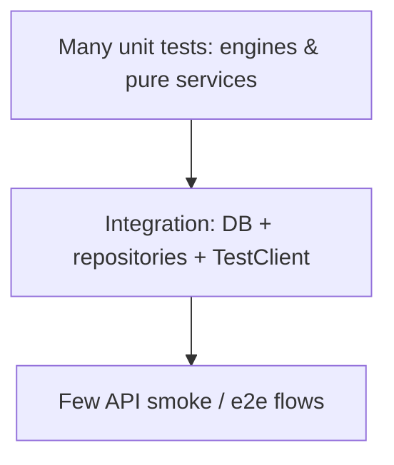

# TradeLab — Development Guidelines

**Document type:** Phase 0 planning  
**Applies to:** Phase A Quant Engine implementation and beyond

---

## 1. Coding Standards

### General

- Python **3.11+** (decide exact minor version before Phase A and pin in project metadata).
- Format with **Ruff format** or **Black**; lint with **Ruff** (preferred single toolchain).
- Type-annotate public functions and service interfaces; aim for gradual **mypy** or **pyright** strictness on `engines/` and `services`.
- Keep functions focused; prefer small pure functions in engines.
- No business logic in routers — routers validate, authorize context, call services, return schemas.
- No FastAPI/SQLAlchemy imports inside ML/indicator/backtest **engines**.
- Do not commit secrets, `.env` with credentials, model weights with sensitive data, or large binaries.

### Project layout principles

- One domain module = schemas + service + repository + ORM models (+ engine if needed).
- Shared cross-cutting code lives in `core/` (config, security, logging, exceptions).
- Third-party I/O behind interfaces/adapters (especially yfinance and S3).

### Documentation in code

- Docstrings on public service methods and engines (purpose, args, raises).
- OpenAPI descriptions on routes for non-obvious endpoints.
- Architecture docs in `docs/` remain source of truth for design changes — update docs when contracts change.

---

## 2. Naming Conventions

| Kind | Convention | Example |
|------|------------|---------|
| Packages / modules | `snake_case` | `market_data`, `paper_trade` |
| Files | `snake_case.py` | `service.py`, `yfinance_provider.py` |
| Classes | `PascalCase` | `BacktestEngine`, `PaperAccount` |
| Functions / methods | `snake_case` | `compute_indicators`, `place_order` |
| Constants | `UPPER_SNAKE` | `DEFAULT_PAGE_SIZE` |
| Pydantic schemas | `PascalCase` + suffix | `BacktestCreateRequest`, `BacktestResponse` |
| ORM models | `PascalCase` singular | `OhlcvBar`, `StrategyVersion` |
| DB tables | `snake_case` plural | `ohlcv_bars`, `strategy_versions` |
| API path segments | `kebab-case` or plural nouns | `/monte-carlo/runs`, `/paper/accounts` |
| Env vars | `UPPER_SNAKE` | `DATABASE_URL`, `JWT_SECRET_KEY` |
| Test files | `test_*.py` | `test_backtest_engine.py` |

### Schema naming

- `*Create`, `*Update`, `*Response`, `*ListResponse` for API models.
- Avoid reusing ORM models as API response types.

---

## 3. Git Branching Strategy

**Model:** Simplified GitHub Flow / trunk-based with short-lived branches.

| Branch | Purpose |
|--------|---------|
| `main` | Stable, releasable; protected |
| `feature/<ticket-or-short-name>` | New capability (e.g., `feature/market-data-fetch`) |
| `fix/<short-name>` | Bug fixes |
| `docs/<short-name>` | Documentation-only changes |
| `chore/<short-name>` | Tooling, deps, CI |

### Rules

1. Branch from latest `main`.
2. Open a PR for review before merge.
3. Prefer squash merge to keep `main` history readable.
4. Delete branch after merge.
5. No long-lived `develop` required for v1 unless the team prefers it.
6. Phase tags optional: `phase-a-a1`, etc., after module completion.

---

## 4. Commit Message Convention

Follow **Conventional Commits**:

```text
<type>(<optional scope>): <short imperative summary>

[optional body]

[optional footer]
```

### Types

| Type | Use |
|------|-----|
| `feat` | New user-facing capability |
| `fix` | Bug fix |
| `docs` | Documentation only |
| `refactor` | Internal change without behavior change |
| `test` | Tests only |
| `chore` | Maintenance, deps, tooling |
| `perf` | Performance improvement |

### Scopes (suggested)

`auth`, `market`, `indicators`, `prediction`, `montecarlo`, `strategy`, `backtest`, `paper`, `reports`, `db`, `api`, `infra`

### Examples

```text
feat(market): add OHLCV fetch job status endpoint
fix(paper): reject orders exceeding available cash
docs(architecture): clarify job runner decision
test(indicators): cover insufficient history validation
```

---

## 5. Testing Strategy

### Pyramid



### Rules

| Layer | What to test | Notes |
|-------|--------------|-------|
| Engines | Indicators, ML train/infer helpers, MC, backtest fill logic | Deterministic; fixed seeds |
| Services | Orchestration, ownership checks, validation branching | Mock repositories/providers |
| API | Status codes, auth enforcement, schema validation | FastAPI TestClient |
| Repositories | Upserts, unique constraints, queries | Real PostgreSQL in CI preferred |

### Practices

- Pytest + fixtures; `conftest.py` per package as needed.
- **No live yfinance** in CI — use fixture DataFrames / recorded samples.
- Mark slow tests (`@pytest.mark.slow`) and exclude from default quick runs if needed.
- Each Phase A module includes tests as a **definition of done**.
- Aim for high coverage on engines and money-path paper trading logic.

---

## 6. Error Handling Strategy

### Exception hierarchy (conceptual)

| Exception | HTTP mapping | When |
|-----------|--------------|------|
| `ValidationError` / Pydantic | 422 | Bad input |
| `UnauthorizedError` | 401 | Missing/invalid token |
| `ForbiddenError` | 403 | Authenticated but not allowed |
| `NotFoundError` | 404 | Missing resource |
| `ConflictError` | 409 | Duplicate email, insufficient cash, state conflict |
| `ProviderError` | 502 | yfinance/upstream failure |
| `DomainError` | 400 | General domain rule breach |
| Unhandled | 500 | Unexpected; log stack + request_id |

### Principles

- Raise domain exceptions in services; map in API exception handlers.
- Never leak stack traces or SQL to clients.
- Include stable `code` strings for frontend handling (e.g., `INSUFFICIENT_CASH`).
- Failed jobs store `error_message` safe for the owning user.

---

## 7. Logging Strategy

- Use stdlib `logging` with a structured formatter (JSON in production).
- Levels: `DEBUG` (dev), `INFO` (requests/jobs lifecycle), `WARNING` (recoverable), `ERROR` (failures).
- Bind `request_id`, `user_id` (when present), `job_id` (when present).
- Log at service boundaries for long jobs: started / succeeded / failed.
- **Never log** passwords, tokens, or full authorization headers.
- Production: ship to **CloudWatch Logs**.

---

## 8. Configuration Management

- Use **Pydantic Settings** (or equivalent) loading from environment variables.
- Separate configs: `local`, `staging`, `production` via `APP_ENV`.
- Feature flags (optional): simple env booleans (e.g., `ENABLE_SHORT_SELLING=false`).
- Alembic reads the same `DATABASE_URL` as the app.
- Dependency versions pinned (lock file: `uv.lock` or `poetry.lock` or pip-tools).

---

## 9. Environment Variables

### Required (typical Phase A)

| Variable | Purpose |
|----------|---------|
| `APP_ENV` | `local` / `staging` / `production` |
| `APP_NAME` | Service name for logs |
| `API_PREFIX` | Default `/api/v1` |
| `DATABASE_URL` | PostgreSQL SQLAlchemy URL |
| `JWT_SECRET_KEY` | Signing key (strong random) |
| `JWT_ACCESS_TOKEN_EXPIRE_MINUTES` | Access TTL |
| `JWT_REFRESH_TOKEN_EXPIRE_DAYS` | Refresh TTL |
| `CORS_ORIGINS` | Comma-separated origins |
| `LOG_LEVEL` | `INFO` default |
| `AWS_REGION` | AWS region |
| `S3_BUCKET` | Artifacts bucket |
| `AWS_ACCESS_KEY_ID` / `AWS_SECRET_ACCESS_KEY` | Or prefer instance IAM role on EC2 |
| `S3_ENDPOINT_URL` | Optional (local mocks) |
| `YFINANCE_TIMEOUT_SECONDS` | Provider timeout |
| `JOB_MAX_MONTE_CARLO_PATHS` | Safety cap |
| `JOB_MAX_BACKTEST_BARS` | Safety cap |

### Local development

- Provide `.env.example` with **placeholder** values only.
- Developers copy to `.env` (gitignored).

### Secrets handling

- Production secrets via OS env / SSM / Secrets Manager (choose before prod).
- IAM role on EC2 preferred over long-lived access keys.

---

## 10. Code Review Checklist (Phase A)

- [ ] Logic in service/engine, not router
- [ ] Ownership checks present
- [ ] Pydantic schemas for I/O
- [ ] Migration included if schema changed
- [ ] Tests added/updated
- [ ] Logs safe and useful
- [ ] Docs updated if API/DB contracts changed
- [ ] No new circular module imports

---

## 11. Definition of Done (per module)

1. Functional requirements for the module met.
2. API endpoints match `api_design.md` (or docs updated).
3. DB entities migrated and indexed as designed.
4. Unit + API tests passing.
5. Basic logging and error mapping in place.
6. README snippet or module note for how to run locally.
