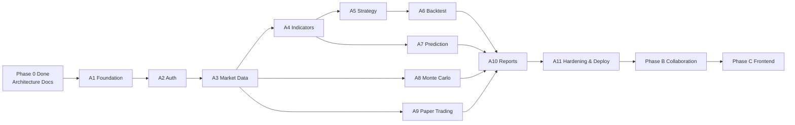

# TradeLab — Project Roadmap

**Document type:** Phase 0 planning  
**Scope of this roadmap:** Phase A Quant Engine broken into modules; Phase B and C summarized for sequencing.

Complexity: **S** = Small · **M** = Medium · **L** = Large · **XL** = Extra large

---

## Phase Overview

---

## Phase A — TradeLab Quant Engine

---

### Module A1 — Project Foundation

| Field | Detail |
|-------|--------|
| **Objective** | Bootstrap the FastAPI modular monolith skeleton, config, DB session, Alembic, logging, health endpoints, and empty module packages with dependency rules enforced. |
| **Deliverables** | App entrypoint; settings; structured logging + request ID; SQLAlchemy base/session; Alembic wired; `/health` `/ready`; lint/test tooling; `.env.example`; README for local run |
| **Dependencies** | Phase 0 docs; PostgreSQL available locally |
| **Estimated complexity** | M |
| **Expected output** | Runnable API that connects to DB and passes a smoke test; **no domain features yet** |

---

### Module A2 — Authentication

| Field | Detail |
|-------|--------|
| **Objective** | Secure user identity with registration, login, JWT access/refresh, and profile endpoints. |
| **Deliverables** | User model + migration; password hashing; JWT utilities; auth router; ownership-ready `CurrentUser` dependency; auth tests |
| **Dependencies** | A1 |
| **Estimated complexity** | M |
| **Expected output** | Clients can register/login and call protected hello-style routes with Bearer tokens |

---

### Module A3 — Market Data

| Field | Detail |
|-------|--------|
| **Objective** | Ingest and serve NSE OHLCV via yfinance with persistence and fetch jobs. |
| **Deliverables** | Symbol + OhlcvBar + MarketDataFetch models; yfinance provider adapter; fetch/list/read APIs; upsert semantics; provider error handling; fixture-based tests |
| **Dependencies** | A2 |
| **Estimated complexity** | L |
| **Expected output** | Authenticated users can resolve symbols, fetch history, and read cached bars |

---

### Module A4 — Technical Indicators

| Field | Detail |
|-------|--------|
| **Objective** | Compute and store technical indicators through a library-agnostic engine (pandas-ta preferred). |
| **Deliverables** | IndicatorEngine; catalog endpoint; compute + run retrieval APIs; persistence model; validation for params/history; tests with sample OHLCV |
| **Dependencies** | A3 |
| **Estimated complexity** | M |
| **Expected output** | Users obtain RSI/MACD/SMA/EMA/BB/ATR (and extensible set) for a symbol range |

---

### Module A5 — Strategy Builder

| Field | Detail |
|-------|--------|
| **Objective** | Persist declarative strategy definitions with versioning and schema validation. |
| **Deliverables** | Strategy + StrategyVersion models; CRUD + version APIs; JSON DSL schema + validator; soft delete; tests |
| **Dependencies** | A2 (A4 useful for validating indicator references in rules) |
| **Estimated complexity** | M |
| **Expected output** | Users create versioned strategies without executing them yet |

---

### Module A6 — Backtesting

| Field | Detail |
|-------|--------|
| **Objective** | Simulate strategy versions on historical data and report metrics/trades. |
| **Deliverables** | BacktestEngine; BacktestRun/Trade tables; job-style API; metrics computation; cost/slippage params; tests with deterministic fixtures |
| **Dependencies** | A3, A5 (A4 if strategies require indicators) |
| **Estimated complexity** | L |
| **Expected output** | Users run backtests and retrieve metrics, trades, and equity |

---

### Module A7 — Prediction (ML)

| Field | Detail |
|-------|--------|
| **Objective** | Train, version, store, and serve sklearn/XGBoost models using features from market/indicators. |
| **Deliverables** | MLEngine (no FastAPI imports); model registry tables; S3 artifact storage; train job + infer APIs; metrics persistence; unit tests with tiny datasets |
| **Dependencies** | A3, A4, S3 access (or local S3 mock for dev) |
| **Estimated complexity** | XL |
| **Expected output** | Users train a versioned model and request predictions for an as-of date |

---

### Module A8 — Monte Carlo

| Field | Detail |
|-------|--------|
| **Objective** | Run configurable Monte Carlo price-path simulations with reproducible seeds. |
| **Deliverables** | MonteCarloEngine; run persistence; summary JSON; optional paths in S3; APIs; capped resource limits; seeded tests |
| **Dependencies** | A3 |
| **Estimated complexity** | M |
| **Expected output** | Users start simulations and retrieve percentile/summary statistics |

---

### Module A9 — Paper Trading

| Field | Detail |
|-------|--------|
| **Objective** | Virtual portfolio with cash, orders, fills, and positions using market data reference prices. |
| **Deliverables** | PaperAccount/Order/Fill/Position (+ ledger); order placement rules; cancel/reset; portfolio APIs; rigorous money-path tests |
| **Dependencies** | A2, A3 |
| **Estimated complexity** | L |
| **Expected output** | Users paper-trade with enforced buying power and visible P&L |

---

### Module A10 — Reports

| Field | Detail |
|-------|--------|
| **Objective** | Aggregate analysis artifacts into structured reports for later sharing (Phase B). |
| **Deliverables** | Report model; generator service; S3 artifact optional; create/list/get/delete APIs; tests |
| **Dependencies** | A4–A9 as available (graceful section types) |
| **Estimated complexity** | M |
| **Expected output** | Users generate JSON reports referencing prior runs/models/accounts |

---

### Module A11 — Hardening, Observability & EC2 Deploy

| Field | Detail |
|-------|--------|
| **Objective** | Productionize v1 on AWS without Docker: security pass, CloudWatch, S3 IAM, backup basics, rate limits, docs. |
| **Deliverables** | Deployment guide; systemd unit sample; CloudWatch logging; alarms checklist; auth rate limiting; performance smoke; secret handling via env/IAM |
| **Dependencies** | A2–A10 minimal viable set (can start earlier in parallel with A10) |
| **Estimated complexity** | L |
| **Expected output** | Quant Engine reachable on EC2 with monitored process and documented release steps |

---

## Phase A Suggested Implementation Order

1. **A1 → A2 → A3** (foundation path)  
2. **A4** then parallelize where possible: **A5** and **A8**  
3. **A6** after A5 (+ A4)  
4. **A7** after A4 (can overlap with A6 staffing permitting)  
5. **A9** after A3 (can overlap with A6/A7)  
6. **A10** once enough artifacts exist  
7. **A11** continuously late Phase A, finalize at end  

---

## Phase B — Collaboration Backend (Summary)

| Module | Objective | Complexity |
|--------|-----------|------------|
| B1 Room service | Create/join cloud rooms; membership | M |
| B2 Chat | Real-time or near-real-time messaging | L |
| B3 File sharing | Upload/share files via S3 + permissions | M |
| B4 Quant linking | Attach reports/backtests to rooms | M |
| B5 AuthZ | Role permissions within rooms | M |

**Dependencies:** Phase A APIs stable; shared user identity (JWT/JWKS or user service).  
**Expected output:** Collaborative spaces that reference Quant Engine artifacts.

---

## Phase C — Frontend (Summary)

| Module | Objective | Complexity |
|--------|-----------|------------|
| C1 App shell | Auth UX, routing, API client | M |
| C2 Market & charts | Symbol explorer, OHLCV/indicator charts | L |
| C3 Research lab | ML, Monte Carlo, strategy, backtest UIs | XL |
| C4 Paper desk | Order ticket, portfolio, P&L | L |
| C5 Collaboration UI | Rooms, chat, sharing | L |

**Dependencies:** Phase A complete for research desk; Phase B for collaboration UI.  
**Expected output:** End-user web application for TradeLab.

---

## Cross-Phase Milestones

| Milestone | Exit criteria |
|-----------|---------------|
| M0 | Phase 0 docs approved |
| M1 | Auth + Market Data usable |
| M2 | Indicators + Strategies + Backtests usable |
| M3 | ML + Monte Carlo usable |
| M4 | Paper trading + Reports usable |
| M5 | EC2 production v1 |
| M6 | Collaboration MVP |
| M7 | Frontend MVP |

---

## Risk-Aware Scheduling Notes

- **A7 (ML)** and **A6 (Backtest)** are the highest uncertainty modules — schedule buffer.
- yfinance reliability may slow **A3** — build cache and fixtures early.
- Decide **async job approach** before A6/A7/A8 to avoid rework.
- S3 should be available (or mocked) before A7/A10 artifact storage.
