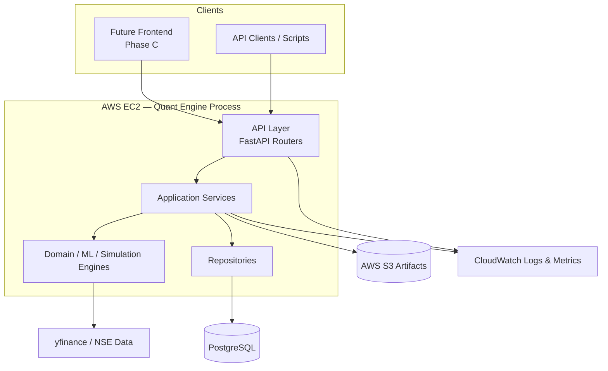
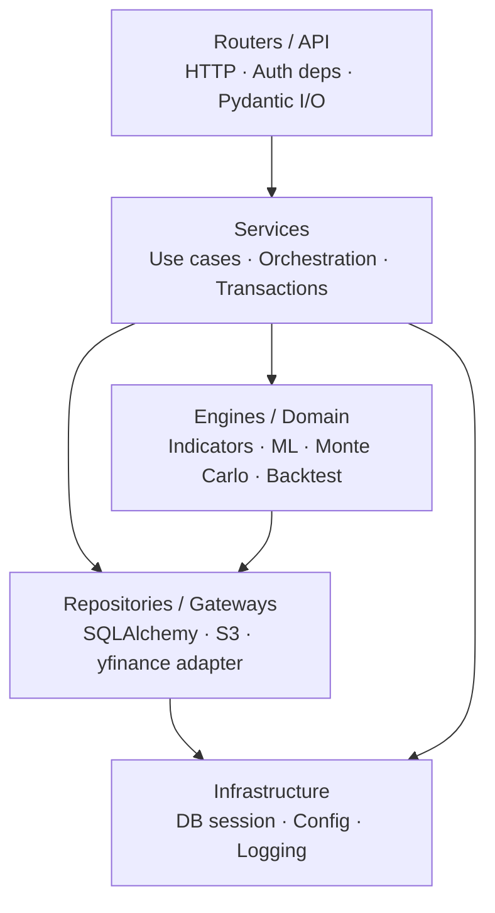
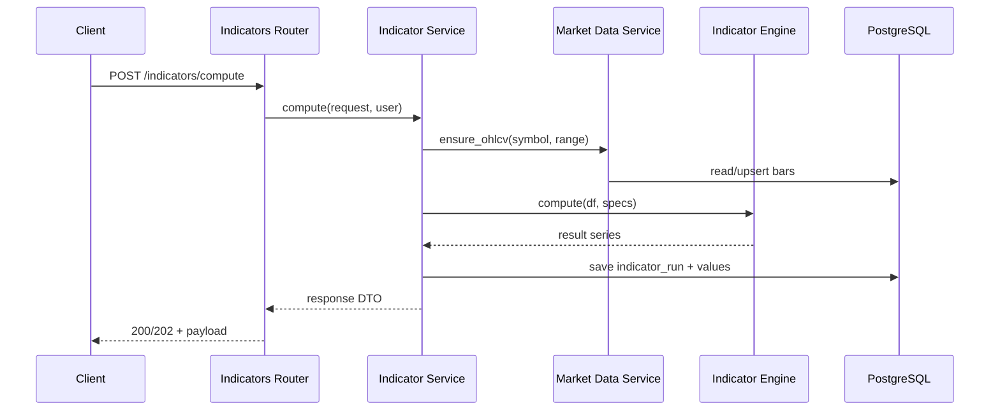
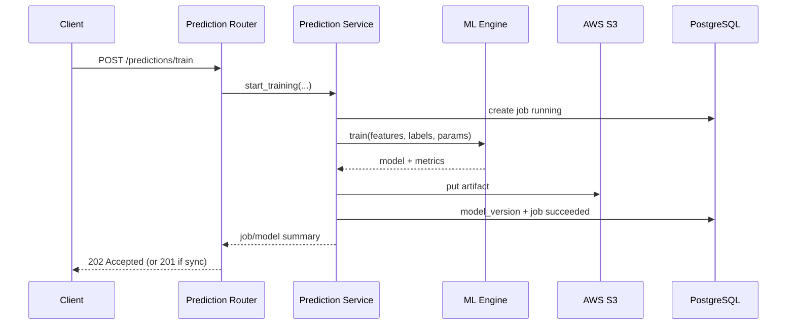
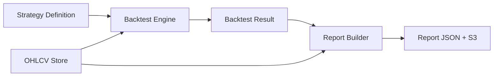
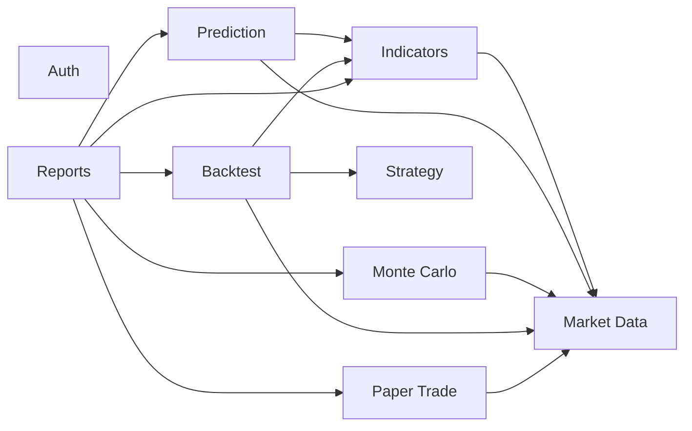
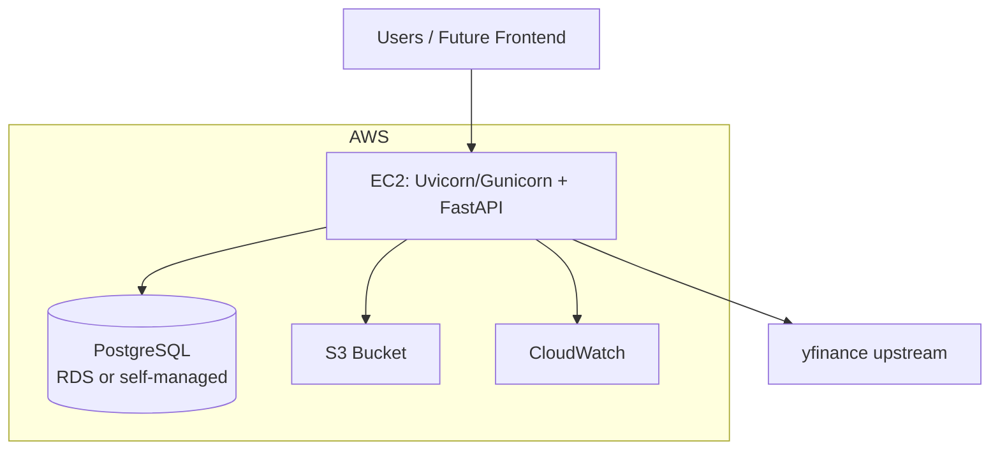

# TradeLab — System Architecture

**Document type:** Phase 0 planning  
**Style:** Modular monolith, microservices-ready  
**Stack:** FastAPI · PostgreSQL · SQLAlchemy · Alembic · Pydantic · JWT · yfinance · scikit-learn · XGBoost · pandas · numpy · pandas-ta · AWS EC2/S3/CloudWatch

---

## 1. Architectural Style

TradeLab Quant Engine (Phase A) is a **modular monolith**:

- One deployable FastAPI application.
- Multiple **domain modules** with explicit boundaries.
- **Dependency rule** enforced so modules can later become independent services.



---

## 2. Layered Dependency Model

Dependencies point **inward/downward** only:



| Layer | May depend on | Must not depend on |
|-------|---------------|-------------------|
| Routers | Services, Pydantic schemas, auth deps | Engines directly, SQLAlchemy models (prefer schemas) |
| Services | Engines, Repositories, domain types | FastAPI `Request`/`Response` objects |
| Engines (ML, indicators, MC, backtest) | numpy/pandas/sklearn/xgboost/pandas-ta, pure domain types | FastAPI, SQLAlchemy sessions |
| Repositories | SQLAlchemy models, DB session | FastAPI, ML libraries |
| Infrastructure | stdlib, settings | Business rules |

This preserves: **business logic independent of routes**, **ML independent of FastAPI**, **DB layer independent of services’ HTTP concerns**.

---

## 3. Major Subsystems

### 3.1 API Gateway Layer (FastAPI)

**Responsibilities**

- HTTP routing under versioned prefix (e.g., `/api/v1`).
- Request/response validation (Pydantic).
- JWT authentication dependency injection.
- Mapping domain/service errors to HTTP status codes.
- OpenAPI documentation generation.

**Not responsible for:** indicator math, model training, SQL details.

### 3.2 Auth Subsystem

**Responsibilities**

- Register/login; password hashing; JWT issue/validate; refresh; profile.
- Provide `CurrentUser` dependency for other routers.

**Data:** `users`, optional `refresh_tokens`.

### 3.3 Market Data Subsystem

**Responsibilities**

- Resolve symbols; fetch OHLCV via **yfinance gateway**; upsert bars; serve cached ranges; record fetch jobs/metadata.
- Enforce freshness and force-refresh policies.

**Adapters:** `MarketDataProvider` interface → `YFinanceProvider` implementation.

### 3.4 Indicators Subsystem

**Responsibilities**

- Accept indicator requests; load OHLCV; call **IndicatorEngine** (pandas-ta adapter); persist series/metadata; return results.

**Engines:** pure functions/classes operating on DataFrames.

### 3.5 Prediction (ML) Subsystem

**Responsibilities**

- Feature assembly orchestration (service); train/evaluate via **MLEngine**; store artifact bytes in S3; metadata in DB; run inference.

**Isolation:** `tradlab_ml` (name TBD) package imports sklearn/xgboost only — never FastAPI.

### 3.6 Monte Carlo Subsystem

**Responsibilities**

- Validate simulation config; run **MonteCarloEngine**; store summaries in DB and optional path payloads in S3.

**A5.6 / A5.7:** trade-resampling and path-dependent portfolio Monte Carlo live in
`app/backtesting/monte_carlo/`. A5.6 resamples completed-trade rupee P&L.
A5.7 resamples historical trade prices and reallocates capital from current cash
using A5.2 sizing and costs. Neither replays candles through the strategy.

**A5.8:** portfolio-level risk lives in `app/backtesting/portfolio_risk/`.
It overlays completed A5.2 trades on a shared cash book (allocation, exposure,
concentration, correlation, drawdown, optional Monte Carlo). Independent
per-symbol backtest quantities are re-sized; they are not treated as a live
portfolio. A5.6 / A5.7 numerical cores are unchanged.

See [`docs/monte_carlo.md`](monte_carlo.md) and `app/backtesting/portfolio_risk/README.md`.

### 3.7 Strategy Subsystem

**Responsibilities**

- CRUD for declarative strategy definitions; schema validation; versioning snapshots for backtests.

### 3.8 Backtesting Subsystem

**Responsibilities**

- Load strategy snapshot + OHLCV (+ indicators if required); run **BacktestEngine**; persist trades, equity curve, metrics as a job result.

### 3.9 Paper Trading Subsystem

**Responsibilities**

- Virtual accounts, orders, fills, positions, P&L; reference prices from market data repository; no broker connectivity.

### 3.10 Reports Subsystem

**Responsibilities**

- Aggregate references to prior artifacts; build structured report documents; store metadata + S3 payload; expose retrieve/list.

### 3.11 Shared Infrastructure

| Component | Role |
|-----------|------|
| Config | Env-based settings (Pydantic Settings) |
| Database | Engine, session factory, Alembic |
| Security | JWT utilities, password hashing |
| Storage | S3 client wrapper |
| Logging | Structured logger + request ID middleware |
| Jobs | In-process or simple DB-backed job runner in v1 (queue extraction later) |

---

## 4. Logical Module Map (Future Package Layout — Not Created in Phase 0)

Conceptual packages (to be created only in Phase A):

```text
app/
  api/                # routers, deps, error handlers
  core/               # config, security, logging
  db/                 # session, base
  modules/
    auth/
    market_data/
    indicators/
    prediction/
    monte_carlo/
    strategy/
    backtest/
    paper_trade/
    reports/
  engines/            # OR engines inside each module — prefer per-module engine/
```

Each module ideally contains: `schemas/`, `service.py`, `repository.py`, `models.py` (ORM), and for compute-heavy modules an `engine/` package with **zero** FastAPI imports.

---

## 5. Data Flow (Representative)

### 5.1 Indicator Request



### 5.2 Model Training



### 5.3 Backtest → Report



---

## 6. Request Lifecycle

1. **Ingress:** Client calls `/api/v1/...` over HTTPS.
2. **Middleware:** Assign `request_id`; log start; optional timing.
3. **Auth (if protected):** Extract Bearer JWT → validate → load `user_id` / roles.
4. **Validation:** Pydantic parses body/query; 422 on failure.
5. **Router:** Calls service method with typed DTOs + user context.
6. **Service:** Orchestrates repositories/engines; opens DB transaction as needed.
7. **Engine/Provider:** Pure compute or external I/O via gateway.
8. **Persist:** Repository writes; S3 for blobs; commit.
9. **Response:** Map to response schema; set status code.
10. **Errors:** Domain errors → 4xx; unexpected → 5xx + logged with `request_id`.
11. **Egress log:** Status, latency, user id (if any).

---

## 7. Dependency Relationships Between Domains



**Rules**

- Prefer depending on **service interfaces** / read models, not foreign ORM graphs across modules.
- Avoid circular imports: shared types go to a small `shared`/`core` kernel if needed.
- Auth is a dependency of all protected modules at the API edge only.

---

## 8. Persistence & Artifact Strategy

| Data | Store |
|------|--------|
| Users, symbols, OHLCV, jobs, strategies, orders, report metadata | PostgreSQL |
| Model binaries, large MC path matrices, bulky report files | S3 |
| Application logs / metrics | CloudWatch |

---

## 9. Job / Async Execution (v1 Design)

Long-running operations (train, backtest, large MC, bulk fetch) use a **Job** abstraction:

| Field (conceptual) | Purpose |
|--------------------|---------|
| id | UUID |
| type | train / backtest / monte_carlo / ... |
| status | queued / running / succeeded / failed |
| created_by | user_id |
| payload / result refs | JSON + optional S3 keys |

**v1 options (decide before Phase A):**

- **A.** Synchronous for small jobs; async via background tasks (`BackgroundTasks` or thread pool) for heavy ones.
- **B.** DB-backed job table + simple worker loop on same EC2 process/supervisor.

Queue products (Celery/RQ/SQS) are Phase A+ unless load demands earlier.

---

## 10. Deployment Architecture (v1, No Docker)



- Process managed by systemd (or similar).
- Env vars for secrets and endpoints.
- Migrations run as a controlled release step (Alembic).

---

## 11. Microservices Migration Path

Without redesigning domain logic:

| Future service | Extract from |
|----------------|--------------|
| Auth Service | Auth module + users |
| Market Data Service | Market data module + provider |
| Analytics Service | Indicators + Monte Carlo |
| ML Service | Prediction engines + artifact store |
| Trading Sim Service | Strategy + Backtest + Paper Trade |
| Reports Service | Reports module |

**Shared contracts:** versioned REST (or later gRPC) using the same Pydantic/OpenAPI shapes.  
**Shared data:** initially shared DB schemas; later split databases per service with API composition.

---

## 12. Cross-Cutting Concerns

| Concern | Approach |
|---------|----------|
| AuthN/Z | JWT; ownership checks in services |
| Validation | Pydantic schemas |
| Errors | Typed exceptions → HTTP mapping |
| Config | Environment variables |
| Observability | Structured logs + CloudWatch |
| Testing | Pytest; engines tested without API |

---

## 13. Explicit Non-Architecture (v1)

- No Docker Compose / K8s.
- No WebSocket market streaming.
- No broker gateway.
- No Phase B collaboration services inside Quant Engine (only extension points, e.g., report IDs shareable later).
