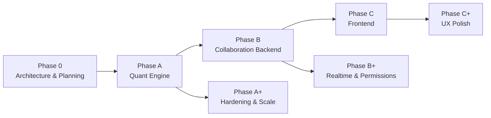

# TradeLab — System Overview

## Vision

TradeLab is a cloud-based collaborative stock analysis platform that enables retail traders, analysts, and research teams to fetch Indian (NSE) market data, compute technical indicators, train and serve machine learning prediction models, run Monte Carlo simulations, design trading strategies, backtest them rigorously, paper-trade with virtual capital, and generate analysis reports — all through a modular, API-first Quant Engine that later becomes the foundation for real-time collaboration and a rich frontend.

## Objectives

1. Deliver a production-ready **TradeLab Quant Engine** (Phase A) as a FastAPI backend with clear module boundaries.
2. Provide reliable **NSE market data** access via yfinance, with caching and auditability of fetches.
3. Enable **technical analysis**, **ML prediction**, and **Monte Carlo** workflows as reusable, API-exposed capabilities.
4. Support **strategy definition**, **backtesting**, and **paper trading** with consistent portfolio and order semantics.
5. Generate **structured analysis reports** that can later be shared in collaborative rooms (Phase B).
6. Architect for **loose coupling** so Phase B (collaboration) and Phase C (frontend) integrate without redesigning the Quant Engine.
7. Keep the design **microservices-ready**: each domain module could later become an independent service with minimal rewrite.

## Scope

### In Scope (Phase A — Quant Engine)

| Domain | Capability |
|--------|------------|
| Authentication | User registration, login, JWT access/refresh, password reset flows (design-level) |
| Market Data | Historical OHLCV for NSE symbols, refresh/cache policies |
| Indicators | Compute and persist technical indicators (pandas-ta / ta) |
| Prediction | Train, evaluate, version, and serve sklearn / XGBoost models |
| Monte Carlo | Price-path and portfolio outcome simulations |
| Strategy Builder | Declarative strategy rules stored as structured definitions |
| Backtesting | Historical simulation of strategies with performance metrics |
| Paper Trading | Virtual wallets, orders, fills, and positions |
| Reports | Aggregated analysis artifacts (JSON + optional S3-stored files) |
| Persistence | PostgreSQL via SQLAlchemy + Alembic migrations |
| Ops (v1) | AWS EC2 deployment, S3 for artifacts, CloudWatch logging/metrics |

### In Scope (Later Phases — Documented for Alignment Only)

- **Phase B**: Cloud rooms, real-time chat, file sharing, presence, permissions.
- **Phase C**: Web frontend consuming Quant + Collaboration APIs.

## Out of Scope

The following are explicitly **out of scope** for the Quant Engine v1 and must not drive Phase A design beyond clean extension points:

| Item | Reason |
|------|--------|
| Live broker order execution / real money trading | Regulatory and integration complexity; paper trading only |
| Real-time tick streaming / WebSocket market feeds | yfinance historical/batch focus in v1 |
| Docker / Kubernetes packaging | Explicitly excluded from version 1 |
| Multi-exchange support beyond NSE (via yfinance) | NSE-first product focus |
| Mobile native apps | Frontend phase is web-first |
| Full collaboration (rooms, chat, sharing) | Phase B |
| UI / frontend implementation | Phase C |
| High-frequency trading / sub-second latency guarantees | Not a Quant Engine v1 goal |
| Options / F&O complex Greeks engines | May appear in future roadmap |
| Microservices deployment in v1 | Modular monolith first; migration path only |

## Major Features

### 1. Authentication & User Management
Secure registration and login with JWT; role-ready user model for future collaborator/admin roles.

### 2. Market Data Service
Fetch and store NSE OHLCV bars; support symbol search/listing; controlled refresh to avoid redundant provider calls.

### 3. Technical Indicators Engine
Compute RSI, MACD, Bollinger Bands, SMA/EMA, ATR, and extensible indicator sets; store results for reuse by strategies and reports.

### 4. Prediction (ML) Pipeline
Feature assembly from prices/indicators; train sklearn/XGBoost models; persist model metadata and artifacts (S3); inference endpoints with version selection.

### 5. Monte Carlo Simulation
Simulate price paths and strategy/portfolio outcomes under configurable assumptions (returns distribution, horizons, paths).

### 6. Strategy Builder
Create, version, and validate strategy definitions (entry/exit rules, position sizing, risk constraints) as structured data — not ad-hoc scripts in the API layer.

### 7. Backtesting Engine
Run strategies over historical windows; emit trades, equity curve, and standard metrics (returns, drawdown, Sharpe-like ratios as applicable).

### 8. Paper Trading
Virtual accounts with cash, positions, and order lifecycle (submit → fill/reject → settle) using latest available market data as reference prices.

### 9. Reporting
Generate analysis reports that bundle market context, indicators, predictions, backtest results, and/or paper P&L; store large artifacts in S3 with DB metadata.

## Future Roadmap

| Horizon | Focus |
|---------|--------|
| **Phase 0** (current) | Architecture, requirements, DB/API design, roadmap — documentation only |
| **Phase A** | Modular Quant Engine on FastAPI + PostgreSQL; all core quant capabilities |
| **Phase A+** | Caching layers, job queues for long ML/backtests, stronger rate limits, observability |
| **Phase B** | Cloud rooms, chat, file sharing; attach Quant reports/artifacts to rooms |
| **Phase B+** | Fine-grained permissions, presence, notifications |
| **Phase C** | SPA/frontend for analysis, charts, strategy UX, paper trading dashboard |
| **Future** | Broker adapters (opt-in), additional markets, Dockerized deploy, optional microservice split |

## Design Principles (Cross-Cutting)

1. **Modular monolith**: One deployable app, multiple domain packages with clear interfaces.
2. **Dependency rule**: API → Services → Domain/ML → Repositories → Database; never invert without an adapter.
3. **ML independence**: Training/inference libraries must not import FastAPI or HTTP concerns.
4. **API-first contracts**: Pydantic schemas define boundaries for Phase C and external clients.
5. **Microservices-ready**: Domain boundaries map 1:1 to candidate future services (Auth, MarketData, Indicators, ML, Simulation, Strategy, Backtest, PaperTrade, Reports).

## Success Criteria for Phase 0

- All nine planning documents plus this overview and `phase0_summary.md` exist under `docs/`.
- Architecture, database, and API designs are complete enough to start Phase A without inventing major structure mid-implementation.
- Open decisions and risks are explicitly listed for stakeholder resolution before coding begins.
